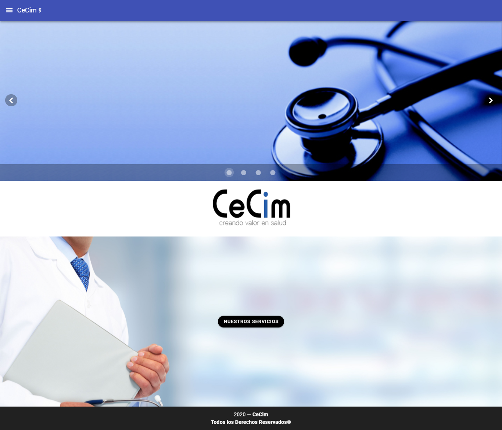
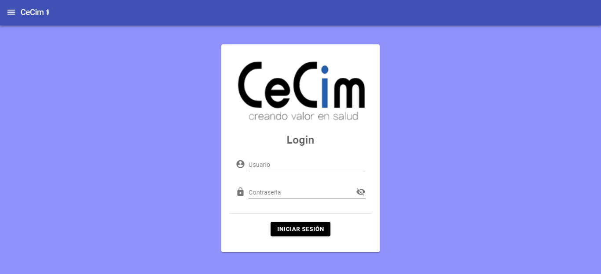
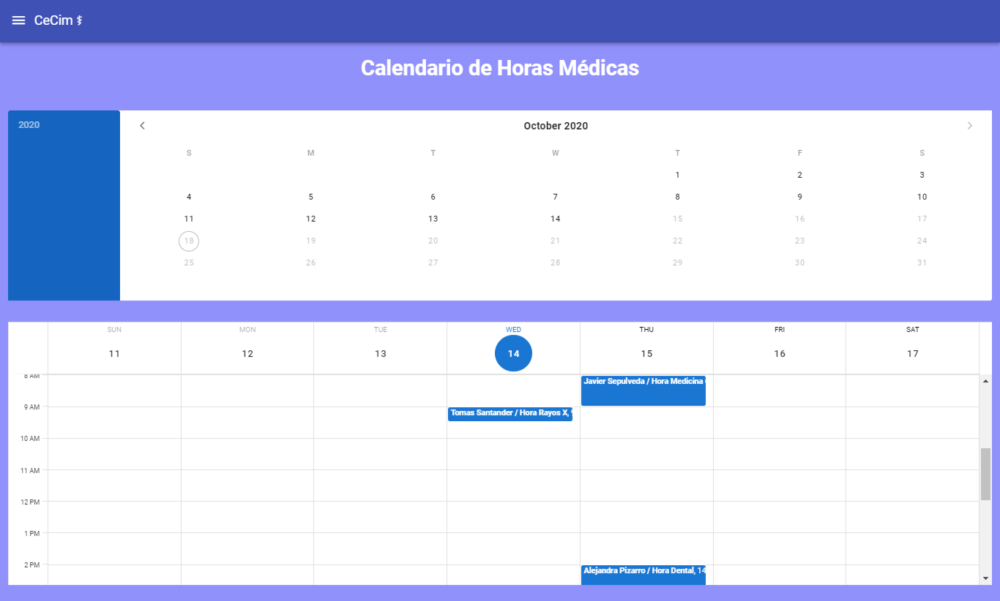
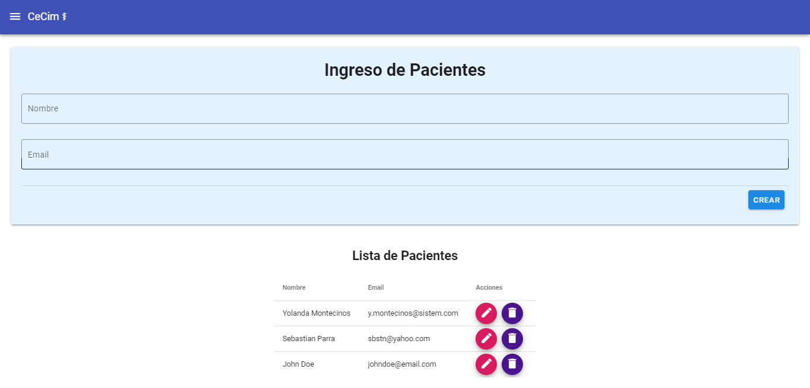

# CeCim Centro Médico

## Descripción del Proyecto

Este proyecto trata de replicar un sitio de internet sobre un centro médico. Se basa en **Vue.js** y usa componentes como **VUEX, Vue Router, Vuetify, y Firebase.**

Para ver otros de mis proyectos, visita el siguiente link https://github.com/Marifuse

## Page View

### Home Page



### Login



### Calendario



### Formulario de Pacientes



## Project setup
```
yarn install
```

### Compiles and hot-reloads for development
```
yarn serve
```

### Compiles and minifies for production
```
yarn build
```

### Lints and fixes files
```
yarn lint
```

### Customize configuration
See [Configuration Reference](https://cli.vuejs.org/config/).

**_María Jesús Fuenzalida S._**

###### Octubre 2020
